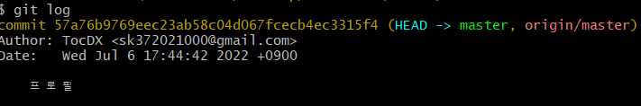
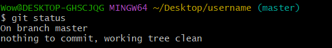
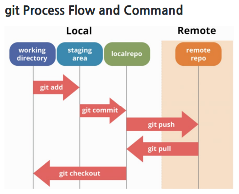
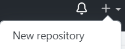
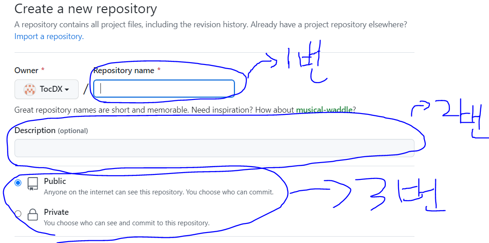
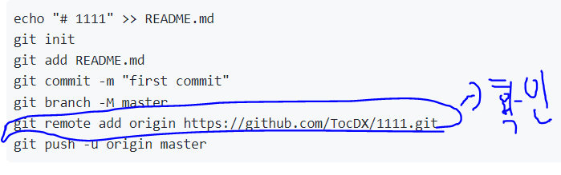
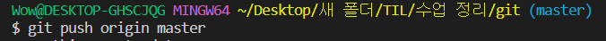

# Git 버전관리

### 버전관리의 정의

1. 버전이란 컴퓨터 소프트웨어의 특정 상태를 말한다.
2. 일반적인 우리가 하는 버전 관리는 _1차, _2차, _최종 등 문서 작업을 할때의 보편적인 
버전관리라 할 수 있다

<aside>
💡 이런식으로 버전 관리를 하게 되면 바뀐게 무엇인지 차이를 알기 힘들다!

</aside>

### 버전관리를 하는 이유

- 차이와 수정 이유를 메시지로 남길 수 있다
- 뼈대 코드 구성, 메인 기능 구현 로그인 기능 구현 등
현재 파일들을 안전한 상태로 과거 모습 그대로 복원이 가능하다(반대로도 마찬가지)

<aside>
💡 즉 버전관리, 소스코드 관리란 동일한 정보에 대한 여러 버전을 관리하는 것을 말한다.

</aside>

### Git이란?

- Git은 분산버전관리시스템으로 코드의 버전을 관리하는 도구
- 2005년 리눅스 커널을 위한 도구로 리누스 토르발스가 개발
- 컴퓨터 파일의 변경사항을 추적하고 여러 명의 사용자들 간에 해당 파일들의 작업을 조율

### 분산버전관리시스템(DVCS)

- 중앙집중식버전관리시스템은 중앙에서 버전을 관리하고 파일을 받아서 사용
- 분산버전관리시스템은 원격 저장소(remote repository)를 통하여 협업하고,
모든 히스토리를 클라이언트들이 공유를 한다.

### 💡저장소를 만들고 기본 명령어를 써보자!

- $ git init
  
    특정 폴더를 git 저장소(repository)를 만들어 git으로 관리
    
    .git 폴더가 생성되며 git bash에서는 (master)라는 표기를 확인할 수 있음
    


<aside>
💡 git init로 git 저장소를 만들어준다
</aside>

- $ git add<file>
  
    working directory상의 변경 내용을 staging area에 추가하기 위해 사용
    untracked 상태의 파일을 staged로 변경,
    modified 상태의 파일을 staged로 변경.
    

```python
Wow@DESKTOP-GHSCJQG MINGW64 ~/Desktop/새 폴더/수업 자료 정리 (master)
$ git status
On branch master

No commits yet  
# 트래킹이 되지 않는 파일이고 git으로 한번도 관리되지 않는 파일입니다
# 그러기에 커밋을 하려면 파일을 add를 해야한다
Untracked files:
  (use "git add <file>..." to include in what will be committed)
        1.txt

nothing added to commit but untracked files present (use "git add" to track)
# 커밋을 할 수 있는게 없기에 add를 통해 파일을 트래킹을 해야한다

$ git add 1.txt
#add 후 커밋 staging Area에 임시저장이 된다
Wow@DESKTOP-GHSCJQG MINGW64 ~/Desktop/새 폴더/수업 자료 정리 (master)        
$ git status
On branch master

No commits yet

Changes to be committed:
  (use "git rm --cached <file>..." to unstage)
        new file:   1.txt
```

- $ git commit -m <’커밋메시지’>
  
    staged 상태의 파일들을 커밋을 통해 버전으로 기록
    
    SHA-1 해시를 사용하여 40자 길이의 체크섬을 생성하고, 이를 통해 고유한 커밋을 표기
    
    커밋 메시지는 변경 사항을 나타낼 수 있도록 명확하게 작성해야 함
    

```python
$ git commit -m "1 커밋완료"
[master (root-commit) bd1a0e9] 1 커밋완료
 1 file changed, 0 insertions(+), 0 deletions(-)
 create mode 100644 1.txt
# 메시지와 함께 커밋을 한다
Wow@DESKTOP-GHSCJQG MINGW64 ~/Desktop/새 폴더/수업 자료 정리 (master)
$ git log
commit bd1a0e9a7c34568b827ea4d63d80faf1621b8b42 (HEAD -> master)
Author: TocDX <sk372021000@gmail.com>
Date:   Tue Jul 5 22:22:09 2022 +0900

    1 커밋완료
#커밋 후 $git log로 커밋이 된 걸 확인한다 
```

- $ git log 
  - 현재 저장소에 기록된 커밋을 조회
  - 다양한 옵션을 통해 로그를 조회 할 수 있다
- 다얀한 명령어
  - git log -1
  - git log --oneline
  - git log -2 --onelie



> 💡oneline = 한줄 -1,2는 갯수!

- $ git status 
  - Git 저장소에 있는 파일의 상태를 확인하기 위하여 활용
    - 파일의 상태를 알 수 있다.
      - Untracked files (**Git 저장소**에는 있지만 **Git이 관리**하지 않는다)
      - Changes not staged for commit (수정한 파일이 Tracked 상태이지만 아직 **Staged** 상태는 아니라는 것이다. **Staged** 상태로 만들려면 git add 명령을 실행해야 한다.)
      - changes to be commited (**Staged 상태**라는 것을 의미한다. 커밋하면 **git add** 를 실행한 시점의  파일이 커밋되어 저장소 히스토리에 남는다.)
- Status로 확인 할 수 있는 파일의 상태
  - Tracked : 이전부터 버전으로 관리되고 있는 파일
    - Unmodified : git status에 나타나지 않음
    - Modified : Changes not staged for commit
    - Staged : Changes to be commit



> 💡 현재는 커밋이 모두 완료된 상태여서 커밋할게 없다!

### Git의 기본 흐름

- Modified : 파일이 수정된 상태 (add 명령어를 통하여 staging area로)
- Staged : 수정한 파일을 곧 커밋할 것이라고 표시한 상태(commit 명령어로 저장소)
- committed : 커밋이 된 상태

| 현재상태          |                                             |
| ----------------- | ------------------------------------------- |
| Working Directory | 파일의 변경사항                             |
| Staging Area      | 버전으로 기록하기 위한 파일 변경사항의 목록 |
| Repository        | 커밋(버전)들이 기록되는 곳                  |

### Git 설정 파일(config)

- 사용자 정보 (commit author) : 커밋을 하기 위해 반드시 필요
  - git config --global user.name "TocDX"
    - **Github에서 설정한 username으로 설정**
  - git config --global user.email "sk372021000@gmail.com"
    - **Github에서 설정한 email로 설정**
- 설정 확인
  - git config -l
  - git config -- global -l
  - git config user.name
- --system
  - /etc/gitconfig
  - 시스템의 모든 사용자와 모든 저장소에 적용 (관리자 권한)
- --global
  - ~/.gitconfig
  - 현재 사용자에게  적용되는 설정
- --local
  - .git/config
  - 특정 저장소에만 적용되는 설정


### 분산버전 관리시스템

- 중앙집중식버전관리시스템은 **중앙에서 버전을 관리하고 파일을 받아서 사용**
- 분산버전관리시스템은 원격 저장소(remote repository)를 통하여 협업하고 
  **모든 히스토리를 클라이언트들이 공유**


### 원격저장소의 흐름




- local은 내 pc, remote는 GitHub이다.


### 원격 저장소 만들기

- New Repositiory

  

- 저장소 설정하기




- 로컬저장소의 버전을 원격 저장소로 보내주기



- $git remote add origin https://....
  - 내 깃허브 네임과 저장소이름이 들어간 url을 원격저장소에 있는 origin을 추가해줘라

- push하기
  - $ git push <TocDX> <Master>
    - 원격 저장소로 로컬 저장소 변경 사항(커밋)을 올림
    - 로컬 폴더의 파일/폴더가 아닌 저장소 버전이 올라감

