# MARK DOWN

## Markdown

### 개요

- 2004년 존 그루버가 만든 텍스트 기반의 가벼운 마크업 언어(html)
- 최초 마크다운에 비해 확장된 문법(표, 주석 등)이 있지만, 본 수업에서는 Github에서 사용
가능한 문법(Github Flavored Markdown을 기준으로 설명

### 특징

- 워드프로세스(한글/MS word)는 다양한 서식과 구조를 지원하며, 문서에 즉각적으로 반영
- 마크다운은 가능한 읽을 수 있도록 최소한의 문법으로 구조화 ( make it as readable as possible)
- 마크다운은 단순 텍스트 문법으로 내용을 작성하며, 다양한 환경에서 변환하여 보여짐
    - 다양한 text editor, 웹 환경에서 모두 지원

### 활용 예

- 기술 블로그
    - 다양한 기술블로그에서는 정적사이트생성기
        - Jekyll, Gatsby, Hugo, Hexo 등을  통해 작성된 마크다운을 HTML, CSS, JS 파일등으로 
        변환하고 Github pages 기능을 통해 호스팅 (외부 공개)
- [README.md](http://README.md)
    - Github 등의 사이트에서는 파일명이 README.md인 것을 모두 보여줌
        - 오픈 소스의 공식 문서를 작성하거나 개인 프로젝트의 프로젝트 소개서로 활용
        - 혹은 모든 페이지에 README.md를 넣어 문서를 바로 볼 수 있도록 활용
- 기타
    - 다양한 개발 환경 뿐만 아니라 일반 SW에서도 많이 사용되고 있음
        - Jupyter notebook에는 별도의 마크다운 셀이 있어, 데이터 분석 등을 하는 과정에서
        프로젝트 내용과 분석 결과를 정리함
        - Notion과 같은 메모/노트 필기 SW에서도 기본 문법으로 마크다운을 채택

### 마크다운 문법 - Heading

- Heading은 문서의 제목이나 소제목으로 사용
    - #의 개수에 따라 대응되는 수준(Heading level)이 있으며, h1~h6까지 표현 가능
    - 문서의 구조를 위해 작성되며 글자 크기를 조절하기 위해 사용되어서는 안됨
    
    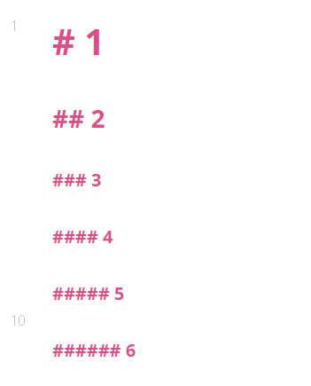
    

### 마크다운 문법 - List

- List는 순서가 있는 리스트(ol)와 순서가 없는 리스트(ul)로 구성
  
    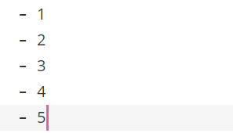
    
    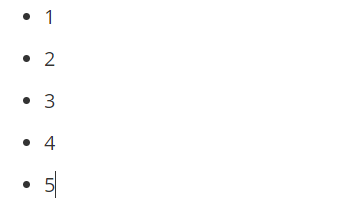

### 마크다운 문법 - Fenced Code block

- 코드 블록은 `(backtick) 기호 3개를 활용하여 작성한다.
- 특정 언어를 명시하면 Syntax highlighting 기능이 적용된다
    - 일부 환경에서는 적용이 되지 않을 수 있음
    
    ```python
    print('hello')
    if True:
    	print('t')
    else:
    	print('f')
    # 주석
    ```
    
    ```html
    print('hello')
    # 주석
    <h1>
    	제목
    <h1>
    <!-- 주석 -->
    ```
    

### 마크다운 문법 - Inline Code block

- 코드블록은 backtick 기호 1개를 인라인에 활용하여 작성(`)

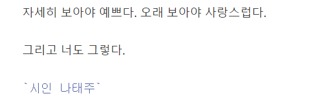

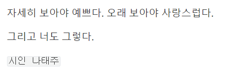

### 마크다운 문법 - 링크

- [내가 원하는 링크명] (링크)
    - 단축키 ctrl + 클릭


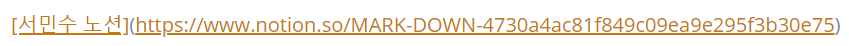

### 마크다운 문법 - 이미지

- 을 통해 이미지를 사용 가능
    - 특정 파일들을 포함하여 연결 시킬 수도 있음
    
    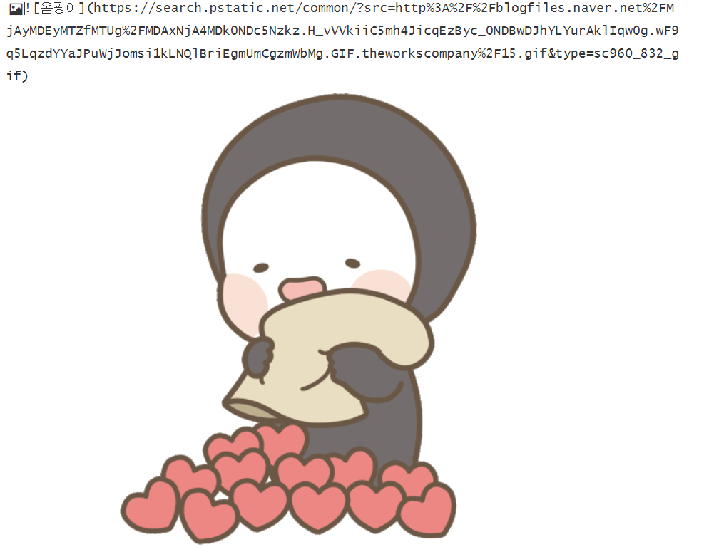
    
    

### 마크다운 문법 - Blockquotes (인용문)

- >를 통해 인용문을 작성

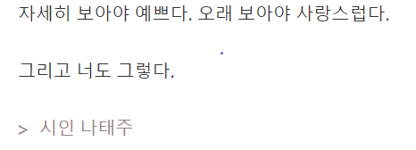

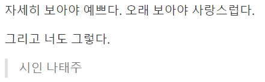

### 마크다운 문법 - Table (표)

- 표는 본문> 표 > 표 삽입 (ctrl + t)
    - 일부 지원 안되는 환경도 있다
    
    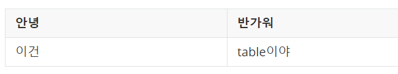
    

### 마크다운 문법 - text 강조

- 굵게(bold), 기울임(ltlic)을 통해 특정 글자들을 강조

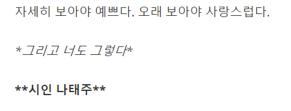

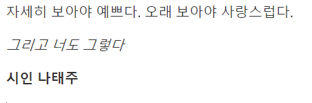

### 마크다운 문법 - 수평선

- 3개 이상의 (***). (—-), (___)


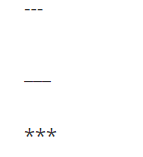

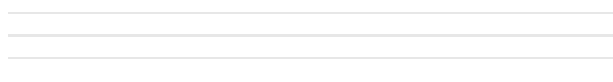